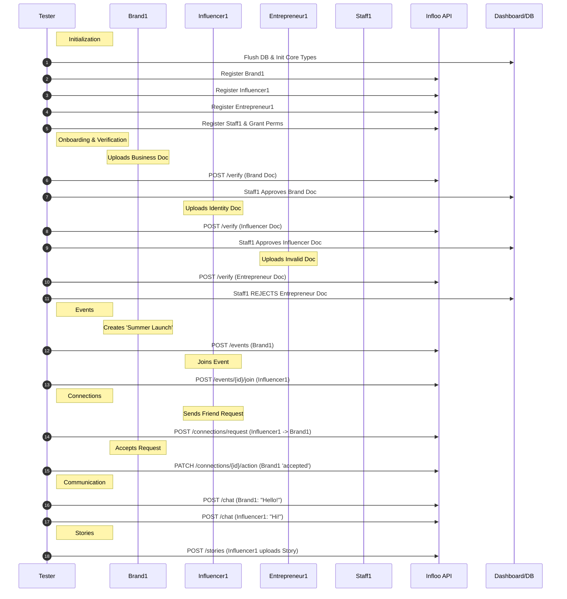

# Infloo System Test Results (API Driven)

**Date:** 2025-12-21 16:24:26.927933+00:00
**Status:** ✅ PASSED
**Executor:** `scripts/run_system_test.py`

## 1. Description
This suite validates the system via **Frontend REST APIs** and Dashboard Actions.

## 2. Logs
```text
🔸 ⚡ RUNNING: run_full_suite...
🔸   ⚡ RUNNING: init_flow...
🔸     ⚡ RUNNING: flush_database...
        📤 Result: Database Cleaned
✅     ✔ DONE: flush_database
🔸     ⚡ RUNNING: create_superuser...
        📥 Payload: {'username': 'admin', 'email': 'admin@infloo.in'}
        📤 Result: Superuser Created: ID 1
✅     ✔ DONE: create_superuser
🔸     ⚡ RUNNING: init_core_types...
        📥 Payload: [{'name': 'Influencer', 'slug': 'influencer', 'is_system': True}, {'name': 'Brand', 'slug': 'brand', 'is_system': True}, {'name': 'Entrepreneur', 'slug': 'entrepreneur', 'is_system': True}, {'name': '...
        📤 Result: Core User Types Initialized: ['influencer', 'brand', 'entrepreneur', 'staff']
✅     ✔ DONE: init_core_types
✅   ✔ DONE: init_flow
🔸   ⚡ RUNNING: user_flow...
🔸     ⚡ RUNNING: register_user...
        📥 Payload: {'username': 'brand1', 'email': 'brand@infloo.in', 'password': 'Secret@123', 'user_type_id': 2, 'phone': '1234567890'}
        📤 Result: User Registered (API): brand1 (ID 2)
✅     ✔ DONE: register_user
🔸     ⚡ RUNNING: register_user...
        📥 Payload: {'username': 'influencer1', 'email': 'inf@infloo.in', 'password': 'Secret@123', 'user_type_id': 1, 'phone': '1234567890'}
        📤 Result: User Registered (API): influencer1 (ID 3)
✅     ✔ DONE: register_user
🔸     ⚡ RUNNING: register_user...
        📥 Payload: {'username': 'entrepreneur1', 'email': 'ent@infloo.in', 'password': 'Secret@123', 'user_type_id': 3, 'phone': '1234567890'}
        📤 Result: User Registered (API): entrepreneur1 (ID 4)
✅     ✔ DONE: register_user
🔸     ⚡ RUNNING: register_user...
        📥 Payload: {'username': 'staff1', 'email': 'staff@infloo.in', 'password': 'Secret@123', 'user_type_id': 4, 'phone': '1234567890'}
        📤 Result: User Registered (API): staff1 (ID 5)
✅     ✔ DONE: register_user
✅   ✔ DONE: user_flow
🔸   ⚡ RUNNING: onboarding_flow...
🔸     ⚡ RUNNING: upload_document...
        📥 Payload: User: brand1, Type: business, File: brand_doc.pdf
        📤 Result: Document Uploaded (API): ID 1
✅     ✔ DONE: upload_document
🔸     ⚡ RUNNING: verify_document_dashboard...
        📥 Payload: Staff: staff1, Action: approve, DocID: 1
        📤 Result: Document Verified (Dashboard): APPROVED
✅     ✔ DONE: verify_document_dashboard
🔸     ⚡ RUNNING: upload_document...
        📥 Payload: User: influencer1, Type: identity, File: inf_id.png
        📤 Result: Document Uploaded (API): ID 2
✅     ✔ DONE: upload_document
🔸     ⚡ RUNNING: verify_document_dashboard...
        📥 Payload: Staff: staff1, Action: approve, DocID: 2
        📤 Result: Document Verified (Dashboard): APPROVED
✅     ✔ DONE: verify_document_dashboard
🔸     ⚡ RUNNING: upload_document...
        📥 Payload: User: entrepreneur1, Type: business, File: fake.pdf
        📤 Result: Document Uploaded (API): ID 3
✅     ✔ DONE: upload_document
🔸     ⚡ RUNNING: verify_document_dashboard...
        📥 Payload: Staff: staff1, Action: reject, DocID: 3
        📤 Result: Document Verified (Dashboard): REJECTED
✅     ✔ DONE: verify_document_dashboard
✅   ✔ DONE: onboarding_flow
🔸   ⚡ RUNNING: events_flow...
🔸     ⚡ RUNNING: create_event...
        📥 Payload: User: brand1, Event: Summer Launch
        📤 Result: Event Created (API): ID 1
✅     ✔ DONE: create_event
🔸     ⚡ RUNNING: join_event...
        📥 Payload: User: influencer1, JOINing Event 1
        📤 Result: Event Joined (API)
✅     ✔ DONE: join_event
✅   ✔ DONE: events_flow
🔸   ⚡ RUNNING: connections_flow...
🔸     ⚡ RUNNING: send_connection_request...
        📥 Payload: Sender: influencer1, ReceiverID: 2
        📤 Result: Connection Request Sent (API)
✅     ✔ DONE: send_connection_request
🔸     ⚡ RUNNING: accept_connection...
        📥 Payload: User: brand1, Update Status: accepted, ID: 1
        📤 Result: Connection Accepted (API)
✅     ✔ DONE: accept_connection
✅   ✔ DONE: connections_flow
🔸   ⚡ RUNNING: chat_flow...
🔸     ⚡ RUNNING: send_message...
        📥 Payload: From: brand1, Msg: Hello!
        📤 Result: Message Sent (API)
✅     ✔ DONE: send_message
🔸     ⚡ RUNNING: send_message...
        📥 Payload: From: influencer1, Msg: Hi!
        📤 Result: Message Sent (API)
✅     ✔ DONE: send_message
✅   ✔ DONE: chat_flow
🔸   ⚡ RUNNING: stories_flow...
🔸     ⚡ RUNNING: post_story...
        📥 Payload: User: influencer1, Story Upload
        📤 Result: Story Posted (API)
✅     ✔ DONE: post_story
✅   ✔ DONE: stories_flow
```

## 3. Visual Flow Diagram (Mermaid)



